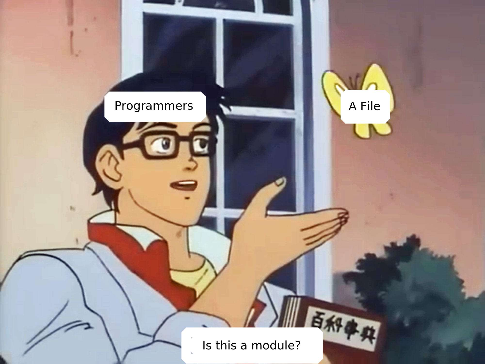

Hi :wave:! I'm a software developer. I use Linux because it is the OS that I find most tolerable. I use Emacs for similar reasons.

For my recreational programming I mostly use Common Lisp, as it has the best support for interactive programming.
Smalltalk being a close second.

My main interest is writing hackable applications.
My ideal DE would be driven from a REPL where each application would be a function.

I go as @PuercoPop on the intertubes. On freenode I hangout on #stumpwm and #lisp.

### Currently learning :mag:

- [ ] APL.
- [ ] Prolog.

### Currently writing :shipit:

- [cl-xcb]

### Obligatory :poop:-post

[cl-xcb]: https://code.puercopop.com/cl-xcb.git/
